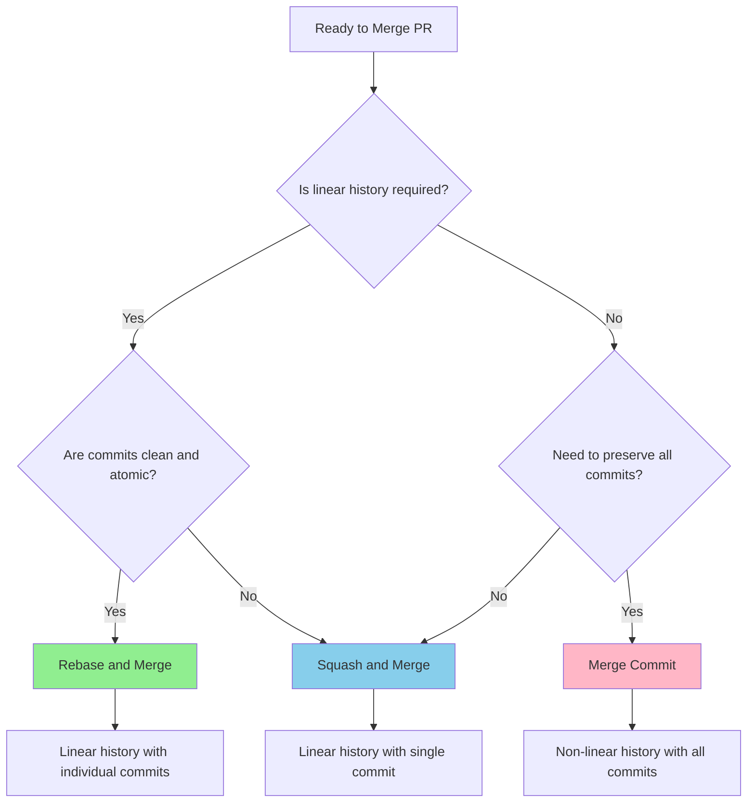

# 🛡️ Branch Protection Rules

> **Navigation:** [Documentation Home](../README.md) → [Development](README.md) → Branch Protection

**Reading Time:** Approximately 15 minutes  
**Complexity:** Intermediate  
**Prerequisites:** GitHub repository admin access, understanding of Git workflows

## 📖 What This Guide Covers

This guide provides comprehensive instructions for configuring GitHub branch protection rules to maintain code quality and enforce security standards. By the end of this guide, you will understand:

1. Why branch protection is critical for project stability
2. How to configure branch protection rules on GitHub
3. Required status checks and their purposes
4. Merge strategies and when to use each
5. GPG commit signing requirements and setup
6. Troubleshooting common branch protection issues

---

## 📋 Section 1: Understanding Branch Protection

### 1.1: Why Branch Protection Matters

Branch protection rules enforce quality standards and prevent common issues:

| Protection | Prevents | Ensures |
|------------|----------|---------|
| **Require Pull Requests** | Direct commits to main | Code review process |
| **Require Status Checks** | Broken code merges | All tests pass |
| **Require Signed Commits** | Unauthorized commits | Commit authenticity |
| **Require Code Owners Review** | Unchecked critical changes | Domain expert approval |
| **Prevent Force Push** | History rewriting | Git history integrity |

### 1.2: Protection Strategy

Platter uses a **strict enforcement strategy** with these principles:

- ✅ **No bypass allowed** - Even administrators must follow the rules
- ✅ **All checks required** - Every status check must pass
- ✅ **Mandatory reviews** - At least one approval required
- ✅ **Signed commits** - GPG signatures enforced for authenticity
- ✅ **Code owner approval** - Domain experts must review relevant changes

---

## 🔧 Section 2: Configuring Branch Protection

### 2.1: Access Branch Protection Settings

**Step 2.1.1: Navigate to Settings**

1. Open your GitHub repository: `https://github.com/Ruthin-School/Platter`
2. Click **Settings** tab (requires admin access)
3. In the left sidebar, click **Branches** under "Code and automation"
4. Locate the **Branch protection rules** section

**Step 2.1.2: Create Protection Rule**

1. Click **Add branch protection rule** button
2. In the **Branch name pattern** field, enter: `main`
3. Configure settings as detailed below

### 2.2: Required Settings Configuration

Configure the following settings exactly as specified:

#### 2.2.1: Pull Request Requirements

**✅ Require a pull request before merging**
- Check this option
- **Required approvals**: Set to `1` (minimum)
- **✅ Dismiss stale pull request approvals when new commits are pushed**: Leave UNCHECKED
  - *Rationale:* Approved PRs remain approved unless re-review is explicitly requested
- **✅ Require review from Code Owners**: Check this option
  - *Requires:* A [`CODEOWNERS`](../../.github/CODEOWNERS:1) file in the repository
  - *Rationale:* Ensures domain experts review relevant changes

**Configuration Screenshot Reference:**
```
[✓] Require a pull request before merging
    Required number of approvals before merging: [1]
    [ ] Dismiss stale pull request approvals when new commits are pushed
    [✓] Require review from Code Owners
    [ ] Restrict who can dismiss pull request reviews
    [✓] Require approval of the most recent reviewable push
```

#### 2.2.2: Status Check Requirements

**✅ Require status checks to pass before merging**
- Check this option
- **✅ Require branches to be up to date before merging**: Check this option
  - *Rationale:* Prevents merging code that hasn't been tested against latest main

**Required Status Checks** (add all of these):
1. `test / Test Suite (ubuntu-latest, stable)` - Core test suite
2. `test / Test Suite (ubuntu-latest, beta)` - Beta Rust compatibility
3. `security / Security Audit` - Dependency security audit
4. `coverage / Code Coverage` - Coverage reporting
5. `build-check / Build Check` - Compilation verification
6. `accessibility / Accessibility Check` - WCAG compliance validation

**Configuration Screenshot Reference:**
```
[✓] Require status checks to pass before merging
    [✓] Require branches to be up to date before merging
    
    Status checks that are required:
    [✓] test / Test Suite (ubuntu-latest, stable)
    [✓] test / Test Suite (ubuntu-latest, beta)
    [✓] security / Security Audit
    [✓] coverage / Code Coverage
    [✓] build-check / Build Check
    [✓] accessibility / Accessibility Check
```

#### 2.2.3: Additional Protection Rules

**✅ Require signed commits**
- Check this option
- *Rationale:* Ensures commit authenticity and prevents impersonation
- *See:* [Section 4: GPG Commit Signing](#section-4-gpg-commit-signing)

**✅ Require linear history**
- Check this option
- *Rationale:* Enforces clean, linear Git history without merge commits
- *Note:* This requires using "Squash and merge" or "Rebase and merge" strategies

**✅ Require deployments to succeed before merging**
- Leave UNCHECKED (unless you have deployment environments configured)

**✅ Lock branch**
- Leave UNCHECKED (this would make the branch read-only)

**✅ Do not allow bypassing the above settings**
- Check this option
- *Rationale:* Ensures even administrators follow the protection rules
- *Critical:* This enforces strict quality standards for everyone

**✅ Restrict who can push to matching branches**
- Leave UNCHECKED (pull requests are required anyway)
- Alternative: Check and configure to restrict to specific teams/users if needed

**Configuration Screenshot Reference:**
```
[✓] Require signed commits
[✓] Require linear history
[ ] Require deployments to succeed before merging
[ ] Lock branch
[✓] Do not allow bypassing the above settings
[ ] Restrict who can push to matching branches

Rules applied to everyone including administrators
[✓] Allow force pushes - EVERYONE (Leave UNCHECKED)
[✓] Allow deletions (Leave UNCHECKED)
```

### 2.3: Save Configuration

**Step 2.3.1: Review Settings**

Before saving, verify all required settings are checked:
- [ ] Require pull request before merging (1 approval, Code Owners required)
- [ ] Require status checks to pass (all 6 checks listed)
- [ ] Require branches to be up to date before merging
- [ ] Require signed commits
- [ ] Require linear history
- [ ] Do not allow bypassing the above settings

**Step 2.3.2: Create Protection Rule**

1. Scroll to the bottom of the page
2. Click **Create** button (or **Save changes** if updating)
3. Confirm the rule is now listed under "Branch protection rules"

---

## ✅ Section 3: Required Status Checks

### 3.1: Status Check Overview

All status checks defined in [`.github/workflows/ci.yml`](../../.github/workflows/ci.yml:1) must pass before merging:

| Check | Purpose | Failure Impact | Configuration |
|-------|---------|----------------|---------------|
| **Test Suite (stable)** | Run all tests on stable Rust | Broken functionality | [`ci.yml:14-82`](../../.github/workflows/ci.yml:14) |
| **Test Suite (beta)** | Verify future compatibility | Future Rust issues | [`ci.yml:14-82`](../../.github/workflows/ci.yml:14) |
| **Security Audit** | Check dependency vulnerabilities | Security risks | [`ci.yml:84-98`](../../.github/workflows/ci.yml:84) |
| **Code Coverage** | Measure test coverage | Insufficient testing | [`ci.yml:100-122`](../../.github/workflows/ci.yml:100) |
| **Build Check** | Verify compilation | Build failures | [`ci.yml:124-138`](../../.github/workflows/ci.yml:124) |
| **Accessibility Check** | WCAG 2.1 AA compliance | Accessibility violations | [`ci.yml:140-163`](../../.github/workflows/ci.yml:140) |

### 3.2: Status Check Details

#### 3.2.1: Test Suite Checks

**What it verifies:**
- All unit tests pass
- All integration tests pass
- Tests run on stable and beta Rust versions
- Tests pass with all feature combinations

**Common failures:**
- Test assertions fail
- Panic in test code
- Timeout (tests run too long)
- Feature-specific test failures

**How to fix:**
```bash
# Run tests locally before pushing
cargo test --all-features

# Run specific test module
cargo test auth::tests

# Run with verbose output
cargo test -- --nocapture
```

#### 3.2.2: Security Audit Check

**What it verifies:**
- No known security vulnerabilities in dependencies
- All dependencies are from trusted sources
- No deprecated crates with known issues

**Common failures:**
- Vulnerable dependency version detected
- Deprecated crate with security issues
- Untrusted crate source

**How to fix:**
```bash
# Run security audit locally
cargo install cargo-audit
cargo audit

# Update vulnerable dependencies
cargo update

# Check specific advisory
cargo audit --db ./advisory-db
```

#### 3.2.3: Code Coverage Check

**What it verifies:**
- Code coverage meets minimum threshold
- New code includes tests
- Coverage report generation succeeds

**Common failures:**
- Coverage drops below threshold
- New code has no tests
- Coverage tool fails

**How to fix:**
```bash
# Generate coverage report locally
cargo install cargo-tarpaulin
cargo tarpaulin --all-features --workspace --out Html

# Open coverage report
open tarpaulin-report.html
```

#### 3.2.4: Build Check

**What it verifies:**
- Code compiles successfully
- No compilation errors
- All feature combinations build
- No warnings with `-D warnings` flag

**Common failures:**
- Syntax errors
- Type errors
- Missing dependencies
- Clippy warnings treated as errors

**How to fix:**
```bash
# Check compilation locally
cargo check --all-targets --all-features

# Check without features
cargo check --all-targets --no-default-features

# Run clippy to catch warnings
cargo clippy --all-targets --all-features -- -D warnings
```

#### 3.2.5: Accessibility Check

**What it verifies:**
- Templates meet WCAG 2.1 Level AA standards
- Color contrast ratios are sufficient
- ARIA attributes are correct
- Semantic HTML is used

**Common failures:**
- Insufficient color contrast
- Missing ARIA labels
- Invalid semantic structure
- Form validation issues

**How to fix:**
```bash
# Run accessibility check locally
cargo run --bin a11y-check --features validate-a11y

# Check specific template
cargo run --bin a11y-check --features validate-a11y -- templates/menu.html
```

### 3.3: Enabling Status Checks

**Step 3.3.1: Verify Workflows Are Enabled**

1. Navigate to **Actions** tab in GitHub repository
2. Verify [`CI`](../../.github/workflows/ci.yml:1) workflow is enabled
3. Ensure workflows run on pull requests to `main` branch

**Step 3.3.2: Add Status Checks to Branch Protection**

1. Go to **Settings** → **Branches** → **Branch protection rules**
2. Edit the `main` branch protection rule
3. Scroll to "Require status checks to pass before merging"
4. Search for and select each required check (they appear after first PR runs)
5. Save changes

**Note:** Status checks only appear in the selection list after they've run at least once on a pull request.

---

## 🔏 Section 4: GPG Commit Signing

### 4.1: Why Signed Commits Matter

GPG (GNU Privacy Guard) signatures provide:

1. **Authentication** - Proves commits are from the claimed author
2. **Integrity** - Ensures commits haven't been tampered with
3. **Non-repudiation** - Creates verifiable audit trail
4. **Trust** - Builds confidence in code provenance

**Security benefits:**
- Prevents commit impersonation
- Detects unauthorized modifications
- Establishes chain of trust
- Meets compliance requirements

### 4.2: Setting Up GPG Signing

#### 4.2.1: Generate GPG Key

**Step 1: Install GPG**

```bash
# Ubuntu/Debian
sudo apt-get install gnupg

# macOS
brew install gnupg

# Verify installation
gpg --version
```

**Step 2: Generate Key Pair**

```bash
# Generate new GPG key
gpg --full-generate-key

# When prompted, choose:
# - Key type: (1) RSA and RSA
# - Key size: 4096 bits
# - Validity: 1y (1 year, or your preference)
# - Real name: Your full name
# - Email: Your GitHub email address
# - Passphrase: Strong passphrase (store securely)
```

**Step 3: List Your Keys**

```bash
# List GPG keys
gpg --list-secret-keys --keyid-format=long

# Output example:
# sec   rsa4096/3AA5C34371567BD2 2024-01-15 [SC] [expires: 2025-01-15]
#       1234567890ABCDEF1234567890ABCDEF12345678
# uid                 [ultimate] Your Name <your.email@example.com>
# ssb   rsa4096/4BB6D45482678CE3 2024-01-15 [E] [expires: 2025-01-15]

# Note the key ID: 3AA5C34371567BD2
```

#### 4.2.2: Configure Git to Sign Commits

**Step 1: Set Signing Key**

```bash
# Configure Git to use your GPG key (replace with your key ID)
git config --global user.signingkey 3AA5C34371567BD2

# Enable commit signing by default
git config --global commit.gpgsign true

# Enable tag signing by default
git config --global tag.gpgsign true
```

**Step 2: Configure GPG Agent**

```bash
# Add to ~/.bashrc or ~/.zshrc
export GPG_TTY=$(tty)

# Reload shell configuration
source ~/.bashrc  # or source ~/.zshrc
```

**Step 3: Test Signing**

```bash
# Create a test signed commit
echo "test" > test.txt
git add test.txt
git commit -m "test: verify GPG signing"

# Verify the signature
git log --show-signature -1

# Expected output should include:
# gpg: Signature made [date]
# gpg: Good signature from "Your Name <your.email@example.com>"
```

#### 4.2.3: Add GPG Key to GitHub

**Step 1: Export Public Key**

```bash
# Export your public GPG key (replace with your key ID)
gpg --armor --export 3AA5C34371567BD2

# Copy the entire output, including:
# -----BEGIN PGP PUBLIC KEY BLOCK-----
# [key content]
# -----END PGP PUBLIC KEY BLOCK-----
```

**Step 2: Add to GitHub**

1. Go to GitHub.com and sign in
2. Click your profile photo → **Settings**
3. In the left sidebar, click **SSH and GPG keys**
4. Click **New GPG key**
5. Paste your public key into the text field
6. Click **Add GPG key**
7. Confirm with your GitHub password if prompted

**Step 3: Verify on GitHub**

1. Make a signed commit and push it
2. Go to the commit on GitHub
3. Look for the **Verified** badge next to the commit
4. Hover over the badge to see signature details

### 4.3: Troubleshooting GPG Signing

#### 4.3.1: "gpg: signing failed: Inappropriate ioctl for device"

**Problem:** GPG cannot prompt for passphrase

**Solution:**
```bash
# Add to ~/.bashrc or ~/.zshrc
export GPG_TTY=$(tty)

# Reload configuration
source ~/.bashrc  # or source ~/.zshrc

# Restart GPG agent
gpgconf --kill gpg-agent
```

#### 4.3.2: "error: gpg failed to sign the data"

**Problem:** Git cannot access GPG key

**Solution:**
```bash
# Verify GPG key is configured
git config --global user.signingkey

# Test GPG signing directly
echo "test" | gpg --clearsign

# If this fails, check GPG installation
gpg --version

# Verify key exists
gpg --list-secret-keys
```

#### 4.3.3: Commits Not Showing "Verified" on GitHub

**Problem:** GitHub cannot verify signature

**Possible causes and solutions:**

1. **Email mismatch:**
   ```bash
   # Ensure Git email matches GPG key email
   git config --global user.email "your.email@example.com"
   
   # Verify GPG key email
   gpg --list-keys
   ```

2. **Public key not added to GitHub:**
   - Follow [Section 4.2.3](#423-add-gpg-key-to-github) to add public key

3. **Expired key:**
   ```bash
   # Check key expiration
   gpg --list-keys
   
   # Extend expiration if needed
   gpg --edit-key 3AA5C34371567BD2
   # In GPG prompt: expire → follow prompts
   ```

---

## 🔀 Section 5: Merge Strategies

### 5.1: Overview of Merge Strategies

Platter supports three merge strategies, each with specific use cases:

| Strategy | When to Use | Advantages | Disadvantages |
|----------|-------------|------------|---------------|
| **Squash and Merge** | Feature branches (preferred) | Clean history, single commit | Loses individual commit details |
| **Rebase and Merge** | Linear history needed | Clean timeline, no merge commits | Requires up-to-date branch |
| **Merge Commit** | Preserving detailed history | Keeps all commits | Creates merge commits |

### 5.2: Squash and Merge (Recommended)

**When to use:**
- Feature branches with multiple commits
- Work-in-progress commits need cleaning
- Creating clean release history
- **Default strategy for most pull requests**

**How it works:**
1. All commits in the branch are combined into a single commit
2. The single commit is added to the main branch
3. Original branch commits are preserved in pull request history
4. Commit message can be edited before merging

**Example workflow:**
```bash
# Developer makes multiple commits on feature branch
git checkout -b feature/add-menu-filter
git commit -m "wip: start filter implementation"
git commit -m "wip: add filter UI"
git commit -m "fix: typo in filter logic"
git commit -m "feat: complete menu filter implementation"

# On GitHub: "Squash and merge"
# Results in single commit on main:
# "feat(menu): add dietary filter functionality (#123)"
```

**Advantages:**
- ✅ Clean, readable main branch history
- ✅ One commit per feature/fix
- ✅ Easy to revert features
- ✅ Simplifies changelog generation

**Disadvantages:**
- ❌ Loses granular commit history
- ❌ Individual commit messages are hidden (but preserved in PR)

### 5.3: Rebase and Merge

**When to use:**
- Clean linear history is required
- Individual commits are well-structured
- Each commit is atomic and meaningful
- Branch protection requires linear history

**How it works:**
1. Commits from the feature branch are rebased onto main
2. Commits are applied one-by-one with original messages
3. No merge commit is created
4. Results in a linear history

**Example workflow:**
```bash
# Developer maintains clean commits on feature branch
git checkout -b fix/authentication-bug
git commit -m "fix(auth): validate session before token refresh"
git commit -m "test(auth): add session validation tests"
git commit -m "docs(auth): update authentication flow documentation"

# Before merging: rebase on latest main
git fetch upstream
git rebase upstream/main

# On GitHub: "Rebase and merge"
# All three commits appear in main branch history
```

**Advantages:**
- ✅ Completely linear history
- ✅ Preserves individual commits
- ✅ Easy to track changes
- ✅ No merge commits

**Disadvantages:**
- ❌ Requires discipline in commit quality
- ❌ Can complicate debugging if commits aren't atomic
- ❌ Force push required when rebasing

### 5.4: Merge Commit (Use Sparingly)

**When to use:**
- Release branches merging to main
- Preserving detailed contribution history
- Multiple developers worked on the same feature
- Historical context is critical

**How it works:**
1. Creates a merge commit that has two parents
2. All individual commits are preserved
3. Merge commit message documents the integration
4. Shows branch and merge points in history

**Example workflow:**
```bash
# Multiple developers contribute to release branch
git checkout -b release/v1.2.0
# [multiple commits from various contributors]

# On GitHub: "Create a merge commit"
# Creates merge commit:
# "Merge pull request #124 from ruthin-school/release/v1.2.0"
```

**Advantages:**
- ✅ Complete history preservation
- ✅ Shows collaboration clearly
- ✅ Easy to see what was merged when
- ✅ Can be reverted as a unit

**Disadvantages:**
- ❌ Creates merge commits (non-linear history)
- ❌ Can clutter main branch history
- ❌ Makes bisecting harder

**Note:** This strategy conflicts with "Require linear history" branch protection and should only be used when that setting is disabled.

### 5.5: Merge Strategy Decision Tree



**Quick reference:**
- 🟢 **Default choice:** Squash and Merge
- 🔵 **Clean commits:** Rebase and Merge  
- 🔴 **Special cases:** Merge Commit (requires disabling linear history)

---

## 🚨 Section 6: Emergency Hotfixes

### 6.1: Hotfix Process with Branch Protection

Even with strict branch protection, critical fixes can be deployed safely:

**Step 6.1.1: Create Hotfix Branch**

```bash
# Create hotfix branch from main
git checkout main
git pull origin main
git checkout -b hotfix/critical-security-fix
```

**Step 6.1.2: Implement and Test Fix**

```bash
# Make necessary changes
# ... edit files ...

# Commit with signed commit
git add .
git commit -S -m "fix(security): patch critical vulnerability CVE-2024-XXXXX"

# Run all checks locally
cargo test --all-features
cargo clippy --all-targets --all-features -- -D warnings
cargo audit
```

**Step 6.1.3: Create Pull Request**

```bash
# Push branch
git push origin hotfix/critical-security-fix

# Create PR on GitHub targeting 'main' branch
# Mark as urgent/critical in description
```

**Step 6.1.4: Fast-Track Review**

Since branch protection is strictly enforced with no bypass:

1. **Request emergency review** - Tag code owners and maintainers
2. **All checks must pass** - CI runs automatically, monitor status
3. **Get required approval** - At least one approval needed
4. **Merge when ready** - Use squash and merge (preferred)

**Important:** Even administrators cannot bypass protection rules. This ensures:
- All hotfixes are tested
- Code review happens even in emergencies
- Quality standards are maintained
- Audit trail is complete

### 6.2: Post-Deployment Hotfix

If a hotfix must be deployed before branch protection allows merge:

1. **Deploy from hotfix branch directly** (not from main)
2. **Complete PR process in parallel**
3. **Merge to main once all checks pass**
4. **Create release tag from main after merge**

This ensures main branch always has complete protection.

---

## 🔍 Section 7: Troubleshooting

### 7.1: Common Issues and Solutions

#### 7.1.1: "Required status check has not run"

**Problem:** Status check doesn't appear or hasn't executed

**Solutions:**
1. **Check workflow file:**
   ```bash
   # Verify workflow is configured correctly
   cat .github/workflows/ci.yml
   
   # Check workflow triggers on PR to main
   # Should include: pull_request: branches: [main]
   ```

2. **Trigger workflow manually:**
   - Go to Actions tab
   - Select the workflow
   - Click "Run workflow"

3. **Verify GitHub Actions are enabled:**
   - Go to repository Settings → Actions
   - Ensure "Allow all actions" is selected

#### 7.1.2: "Review required from code owner"

**Problem:** Cannot merge without code owner approval

**Solutions:**
1. **Check CODEOWNERS file:**
   ```bash
   # View CODEOWNERS file
   cat .github/CODEOWNERS
   
   # Example content:
   # * @team-leads
   # /docs/ @documentation-team
   # /src/auth.rs @security-team
   ```

2. **Request review from code owner:**
   - Identify relevant code owner from CODEOWNERS
   - Request review from that person/team in PR

3. **Create CODEOWNERS if missing:**
   ```bash
   # Create .github/CODEOWNERS file
   mkdir -p .github
   cat > .github/CODEOWNERS << 'EOF'
   # Default owners for everything
   * @ruthin-school/maintainers
   
   # Specific module owners
   /src/auth.rs @security-team
   /docs/ @documentation-team
   /.github/ @devops-team
   EOF
   
   git add .github/CODEOWNERS
   git commit -S -m "chore: add CODEOWNERS file"
   ```

#### 7.1.3: "Commits must be signed"

**Problem:** Cannot merge because commits aren't GPG signed

**Solutions:**
1. **Sign existing commits:**
   ```bash
   # Rebase and sign all commits in PR
   git rebase --exec 'git commit --amend --no-edit -S' upstream/main
   
   # Force push (requires force push permission on PR branch)
   git push --force-with-lease
   ```

2. **Configure Git for automatic signing:**
   ```bash
   # Enable signing by default
   git config --global commit.gpgsign true
   git config --global tag.gpgsign true
   
   # Set your GPG key
   git config --global user.signingkey YOUR_KEY_ID
   ```

3. **Verify GPG setup:**
   ```bash
   # Test GPG signing
   echo "test" | gpg --clearsign
   
   # Check Git configuration
   git config --global --get user.signingkey
   git config --global --get commit.gpgsign
   ```

#### 7.1.4: "Branch is not up to date"

**Problem:** Cannot merge because branch is behind main

**Solutions:**
1. **Update branch with rebase:**
   ```bash
   # Fetch latest main
   git fetch upstream
   
   # Rebase your branch
   git rebase upstream/main
   
   # Resolve any conflicts
   # Edit files, then:
   git add <resolved-files>
   git rebase --continue
   
   # Force push (force-with-lease is safer)
   git push --force-with-lease
   ```

2. **Update branch with merge (if rebase fails):**
   ```bash
   # Fetch and merge main
   git fetch upstream
   git merge upstream/main
   
   # Resolve conflicts and commit
   git add <resolved-files>
   git commit -S -m "merge: resolve conflicts with main"
   
   # Push normally
   git push
   ```

#### 7.1.5: "All checks must pass"

**Problem:** Some CI checks are failing

**Solutions:**

**For test failures:**
```bash
# Run tests locally
cargo test --all-features

# Run specific failing test
cargo test test_name -- --nocapture

# Check for race conditions
cargo test -- --test-threads=1
```

**For clippy failures:**
```bash
# Run clippy locally
cargo clippy --all-targets --all-features -- -D warnings

# Auto-fix some issues
cargo clippy --fix --all-targets --all-features
```

**For format failures:**
```bash
# Check formatting
cargo fmt -- --check

# Auto-format code
cargo fmt
```

**For security audit failures:**
```bash
# Run audit locally
cargo audit

# Update dependencies
cargo update

# Check specific advisory
cargo audit --db ./advisory-db
```

### 7.2: Getting Help

If you encounter issues not covered here:

1. **Check CI logs:** Review failed workflow runs in Actions tab
2. **Search issues:** Look for similar problems in GitHub Issues
3. **Ask maintainers:** Tag repository maintainers in PR comments
4. **Documentation:** Review related guides:
   - [Git Workflow Guide](git-workflow.md)
   - [Contributing Guidelines](contributing.md)
   - [Testing Guide](testing.md)

---

## 📖 Related Documentation

Access these resources for additional information:

- **[Merge Strategies Guide](merge-strategies.md)** - Detailed merge strategy documentation
- **[Git Workflow Guide](git-workflow.md)** - Git workflow and release tagging
- **[Git Hooks Guide](git-hooks.md)** - Pre-commit and commit-msg hooks
- **[Contributing Guidelines](contributing.md)** - Contribution process and standards
- **[CI/CD Workflows](../../.github/workflows/README.md)** - GitHub Actions configuration

---

## 🎯 Next Steps

After configuring branch protection:

1. **Create CODEOWNERS file** - Define code ownership (if not exists)
2. **Configure required checks** - Add all CI checks to branch protection
3. **Set up GPG signing** - Ensure all contributors have GPG keys configured
4. **Test the workflow** - Create a test PR to verify all protections work
5. **Update team documentation** - Inform team of new requirements

**For team leads:**
- Ensure all team members have GPG keys set up
- Verify team members are added to relevant CODEOWNERS sections
- Create onboarding documentation for new contributors
- Schedule training on signed commits and merge strategies

---

[← Back to Development](README.md) | [Documentation Home](../README.md)