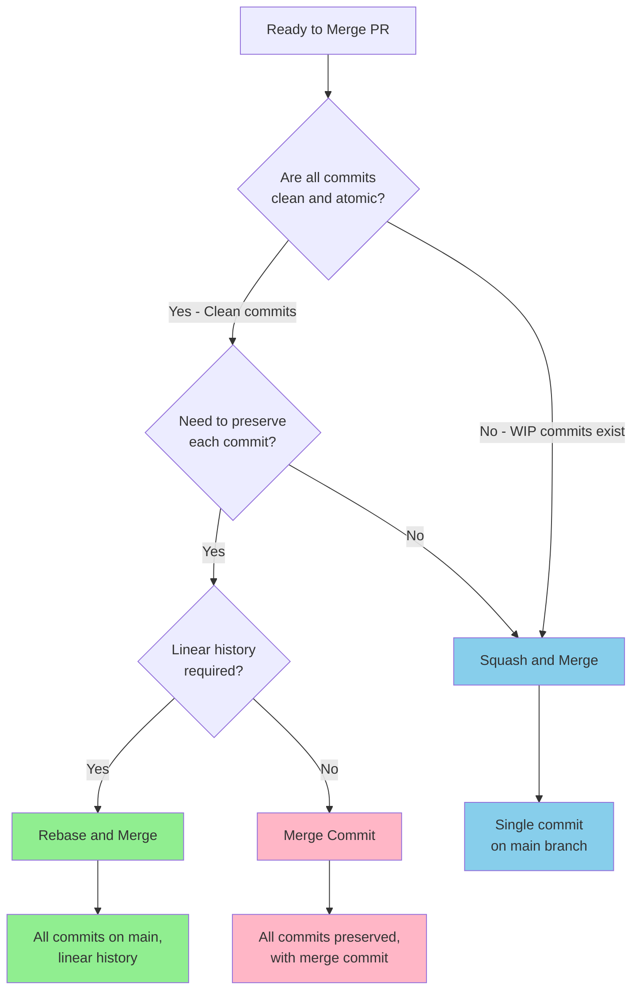

# 🔀 Merge Strategies Guide

> **Navigation:** [Documentation Home](../README.md) → [Development](README.md) → Merge Strategies

**Reading Time:** Approximately 20 minutes  
**Complexity:** Intermediate to Advanced  
**Prerequisites:** Basic Git knowledge, understanding of branching workflows

## 📖 What This Guide Covers

This guide provides comprehensive instructions for choosing and implementing Git merge strategies. By the end of this guide, you will understand:

1. The three primary merge strategies and when to use each
2. How to perform interactive rebases to clean up commit history
3. Best practices for conflict resolution
4. Decision-making frameworks for selecting the right strategy
5. Advanced techniques for maintaining clean Git history
6. Common pitfalls and how to avoid them

---

## 📋 Section 1: Merge Strategy Overview

### 1.1: The Three Strategies

Git provides three primary strategies for integrating changes from one branch to another:

| Strategy | History Result | Use Case | Complexity |
|----------|---------------|----------|------------|
| **Squash and Merge** | Single commit | Feature branches | Low |
| **Rebase and Merge** | Linear history | Clean atomic commits | Medium |
| **Merge Commit** | Non-linear | Preserve full history | Low |

### 1.2: Strategy Selection Matrix

Choose your strategy based on these factors:

| Factor | Squash | Rebase | Merge Commit |
|--------|--------|--------|--------------|
| **Commit Quality** | Any | Must be clean | Any |
| **History Preference** | Concise | Linear | Complete |
| **Team Size** | Any | Small to medium | Large |
| **Branch Lifetime** | Short-lived | Short-lived | Long-lived |
| **Revert Ease** | Easy (one commit) | Medium | Easy (merge commit) |

### 1.3: Platter's Strategy Preferences

Based on the project's requirements:

1. ⭐ **Primary:** Squash and Merge (90% of PRs)
2. 🔄 **Alternative:** Rebase and Merge (for clean commits)
3. 🚫 **Restricted:** Merge Commit (conflicts with linear history requirement)

**Note:** Branch protection requires linear history, which excludes traditional merge commits.

---

## 🎯 Section 2: Squash and Merge

### 2.1: Overview

Squash and merge combines all commits from a feature branch into a single commit before merging to main.

**Visual representation:**
```
Before squash:
feature  A---B---C---D
        /
main   M

After squash and merge:
main   M---S (S contains all changes from A, B, C, D)
```

### 2.2: When to Use Squash and Merge

**✅ Ideal scenarios:**
- Feature branches with multiple work-in-progress commits
- Experimental work with trial-and-error commits
- Commits that don't follow conventional commit format
- Creating clean release notes and changelogs
- Default strategy for most pull requests

**❌ Avoid when:**
- Each commit represents a distinct logical change
- Commits are already clean and atomic
- You need to preserve individual contributor attribution
- The feature requires multiple distinct changes that should be separate

### 2.3: How Squash and Merge Works

**Step 2.3.1: Developer Workflow**

```bash
# Create feature branch
git checkout -b feature/add-menu-export

# Make incremental commits (can be messy)
git commit -m "wip: start export feature"
git commit -m "wip: add CSV export"
git commit -m "fix: typo in export function"
git commit -m "wip: add JSON export"
git commit -m "feat: complete menu export feature"
git commit -m "fix: handle empty menu case"
git commit -m "docs: add export documentation"

# Push to remote
git push origin feature/add-menu-export
```

**Step 2.3.2: On GitHub Pull Request**

1. Create pull request from `feature/add-menu-export` to `main`
2. Get required approvals
3. Wait for all status checks to pass
4. Click **"Squash and merge"** button
5. Edit the squashed commit message:
   ```
   feat(menu): add CSV and JSON export functionality
   
   Implements menu export in multiple formats:
   - CSV export for spreadsheet applications
   - JSON export for API integration
   - Handles empty menus gracefully
   
   Closes #156
   ```
6. Confirm merge

**Step 2.3.3: Result on Main Branch**

```bash
# Main branch now has a single clean commit
git log --oneline main

# Output:
# abc1234 feat(menu): add CSV and JSON export functionality
# def5678 Previous commit
```

### 2.4: Benefits and Drawbacks

**Advantages:**
- ✅ Clean, readable main branch history
- ✅ One commit per feature makes reverting easy
- ✅ Simplified changelog generation
- ✅ Works well with semantic versioning
- ✅ Reduces noise from WIP commits
- ✅ Easier to track features in history

**Disadvantages:**
- ❌ Loses granular commit history (though preserved in PR)
- ❌ All changes attributed to merger, not original authors
- ❌ Cannot cherry-pick individual logical changes
- ❌ Harder to identify which specific change caused an issue

### 2.5: Best Practices

**Do:**
```bash
# ✅ Write detailed squash commit message
feat(auth): implement OAuth 2.0 with Microsoft Entra ID

- Add OAuth configuration and endpoints
- Implement PKCE flow for enhanced security
- Add session management with secure cookies
- Include comprehensive error handling
- Update documentation and tests

Closes #123
```

**Don't:**
```bash
# ❌ Generic squash commit message
feat: add OAuth

# ❌ Leaving WIP message
wip: various oauth changes
```

**Squash commit message template:**
```
type(scope): concise description of the overall change

- Bullet point highlighting key change 1
- Bullet point highlighting key change 2
- Bullet point highlighting key change 3
- Related documentation updates
- Test coverage notes

Closes #issue-number
```

---

## 🔄 Section 3: Rebase and Merge

### 3.1: Overview

Rebase and merge replays commits from the feature branch onto main, creating a linear history without merge commits.

**Visual representation:**
```
Before rebase:
feature  A---B---C
        /
main   M---N

After rebase and merge:
main   M---N---A'---B'---C'
```

### 3.2: When to Use Rebase and Merge

**✅ Ideal scenarios:**
- Each commit is atomic and well-formed
- Commits follow conventional commit format
- Changes are logically separated
- You want to preserve commit-level history
- Linear history is required (Platter's default)

**❌ Avoid when:**
- Commits are messy or experimental
- Multiple people worked on the same commits
- Commits contain sensitive information
- You're not comfortable with Git rebase

### 3.3: How Rebase and Merge Works

**Step 3.3.1: Create Clean Commits**

```bash
# Create feature branch
git checkout -b fix/authentication-session-bug

# Make first logical commit
git add src/auth.rs
git commit -S -m "fix(auth): validate session expiry before token refresh

Prevents using expired sessions for token refresh, which could
allow unauthorized access after session timeout.

Refs #234"

# Make second logical commit (tests)
git add tests/auth_tests.rs
git commit -S -m "test(auth): add session expiry validation tests

Covers edge cases:
- Expired session token refresh attempt
- Valid session token refresh
- Session renewal timing

Refs #234"

# Make third logical commit (docs)
git add docs/architecture/security.md
git commit -S -m "docs(security): document session expiry handling

Updates authentication flow documentation to reflect
session expiry validation in token refresh process.

Refs #234"
```

**Step 3.3.2: Keep Branch Updated**

```bash
# Before creating PR, rebase on latest main
git fetch upstream
git rebase upstream/main

# Resolve any conflicts
# ... edit conflicted files ...
git add <resolved-files>
git rebase --continue

# Force push (use --force-with-lease for safety)
git push --force-with-lease origin fix/authentication-session-bug
```

**Step 3.3.3: Merge on GitHub**

1. Create pull request
2. Ensure all commits are clean and follow conventions
3. Get required approvals
4. Verify all status checks pass
5. Click **"Rebase and merge"** button
6. Confirm merge

**Step 3.3.4: Result on Main Branch**

```bash
# Main branch has all three commits
git log --oneline main

# Output:
# abc1234 docs(security): document session expiry handling
# def5678 test(auth): add session expiry validation tests
# ghi9012 fix(auth): validate session expiry before token refresh
# jkl3456 Previous commit
```

### 3.4: Benefits and Drawbacks

**Advantages:**
- ✅ Completely linear history
- ✅ Preserves individual commits
- ✅ Easy to understand change progression
- ✅ Can cherry-pick specific commits
- ✅ Better git bisect support
- ✅ Maintains proper commit attribution

**Disadvantages:**
- ❌ Requires discipline in commit quality
- ❌ Rewriting history can be complex
- ❌ Force push needed after rebase
- ❌ Conflicts must be resolved for each commit
- ❌ Not suitable for collaborative branches

### 3.5: Best Practices

**Commit quality checklist:**
```bash
# Before rebasing, ensure each commit:
# ✅ Has a clear, conventional commit message
# ✅ Contains a single logical change
# ✅ Builds and passes tests independently
# ✅ Is properly signed with GPG
# ✅ Follows project coding standards
```

**Safe rebasing workflow:**
```bash
# 1. Always create a backup branch
git branch backup-feature-branch

# 2. Rebase interactively to clean up commits
git rebase -i upstream/main

# 3. Test after rebase
cargo test --all-features
cargo clippy --all-targets --all-features

# 4. Force push with safety check
git push --force-with-lease origin feature-branch

# 5. Delete backup if successful
git branch -D backup-feature-branch
```

---

## 📝 Section 4: Interactive Rebase

### 4.1: Overview

Interactive rebase allows you to modify commit history by reordering, squashing, editing, or dropping commits.

**Use cases:**
- Clean up messy commit history before merging
- Combine related commits
- Fix commit messages
- Reorder commits logically
- Remove sensitive information

### 4.2: Interactive Rebase Commands

When you run `git rebase -i`, you can use these commands:

| Command | Shortcut | Action | Example Use |
|---------|----------|--------|-------------|
| `pick` | `p` | Use commit as-is | Keep good commits |
| `reword` | `r` | Change commit message | Fix typos in messages |
| `edit` | `e` | Modify commit content | Split large commits |
| `squash` | `s` | Merge with previous | Combine related changes |
| `fixup` | `f` | Squash, discard message | Absorb "fix typo" commits |
| `drop` | `d` | Remove commit | Delete unnecessary commits |

### 4.3: Squashing Commits Locally

**Step 4.3.1: Start Interactive Rebase**

```bash
# View commit history
git log --oneline

# Output:
# a1b2c3d docs: update README
# e4f5g6h fix: typo in function name
# i7j8k9l fix: another small typo
# m1n2o3p feat: add menu export feature
# p4q5r6s wip: progress on export
# s7t8u9v wip: starting export feature

# Rebase last 6 commits interactively
git rebase -i HEAD~6
```

**Step 4.3.2: Edit Rebase Instructions**

Your editor opens with:
```
pick s7t8u9v wip: starting export feature
pick p4q5r6s wip: progress on export
pick m1n2o3p feat: add menu export feature
pick i7j8k9l fix: another small typo
pick e4f5g6h fix: typo in function name
pick a1b2c3d docs: update README

# Commands:
# p, pick = use commit
# r, reword = use commit, but edit the commit message
# e, edit = use commit, but stop for amending
# s, squash = use commit, but meld into previous commit
# f, fixup = like squash, but discard this commit's message
```

**Change to:**
```
pick s7t8u9v wip: starting export feature
fixup p4q5r6s wip: progress on export
squash m1n2o3p feat: add menu export feature
fixup i7j8k9l fix: another small typo
fixup e4f5g6h fix: typo in function name
pick a1b2c3d docs: update README
```

**Step 4.3.3: Edit Squashed Commit Message**

After saving, Git will prompt for the squashed commit message:
```
# This is a combination of 3 commits
# The first commit message is:
wip: starting export feature

# This is the 2nd commit message:
feat: add menu export feature

# Please enter the commit message for your changes
```

**Replace with:**
```
feat(menu): implement CSV and JSON export functionality

Implements comprehensive menu export feature:
- CSV format for spreadsheet compatibility
- JSON format for API integration
- Robust error handling for edge cases
- Unit tests for all export formats

Refs #156
```

**Step 4.3.4: Complete Rebase**

```bash
# Save and close the editor
# Git completes the rebase

# Verify result
git log --oneline

# Output (clean history):
# a1b2c3d docs: update README
# x9y8z7w feat(menu): implement CSV and JSON export functionality
```

### 4.4: Rewriting Commit Messages

**Fix the last commit message:**
```bash
# Amend the most recent commit message
git commit --amend

# Opens editor to modify message
# Save and close to apply changes
```

**Fix an older commit message:**
```bash
# Start interactive rebase
git rebase -i HEAD~5

# In the editor, change 'pick' to 'reword' for the commit
reword abc1234 Old commit message here
pick def5678 Another commit
pick ghi9012 Yet another commit

# Save and close
# Git will prompt you to rewrite the commit message
# Edit the message, save, and close
```

### 4.5: Splitting Commits

Sometimes a commit is too large and should be split:

```bash
# Start interactive rebase
git rebase -i HEAD~3

# Mark commit for editing
edit abc1234 Large commit to split
pick def5678 Another commit

# Git pauses at the commit
# Reset to previous commit, keeping changes
git reset HEAD^

# Stage and commit first logical change
git add src/feature1.rs
git commit -m "feat(feature1): implement first feature"

# Stage and commit second logical change
git add src/feature2.rs
git commit -m "feat(feature2): implement second feature"

# Continue rebase
git rebase --continue
```

### 4.6: Interactive Rebase Best Practices

**Before rebasing:**
```bash
# ✅ Create backup branch
git branch backup-feature

# ✅ Ensure working directory is clean
git status

# ✅ Know what you want to achieve
# List out the desired commit structure
```

**During rebasing:**
```bash
# ✅ Test after each significant change
cargo test

# ✅ If things go wrong, abort
git rebase --abort

# ✅ Restore from backup if needed
git reset --hard backup-feature
```

**After rebasing:**
```bash
# ✅ Verify commit history
git log --oneline

# ✅ Test thoroughly
cargo test --all-features
cargo clippy --all-targets --all-features

# ✅ Force push safely
git push --force-with-lease

# ✅ Delete backup after confirmation
git branch -D backup-feature
```

---

## 🔧 Section 5: Conflict Resolution

### 5.1: Understanding Merge Conflicts

Conflicts occur when Git cannot automatically merge changes because:
- Same lines modified in different branches
- File deleted in one branch, modified in another
- File renamed in one branch, modified in another
- Binary file conflicts

### 5.2: Conflict Resolution Strategies

#### 5.2.1: Prevention Strategies

**Keep branches short-lived:**
```bash
# ✅ Merge or rebase frequently
git fetch upstream
git rebase upstream/main  # Do this daily for long-lived branches

# ✅ Break large features into smaller PRs
# Instead of one large PR, create multiple smaller ones

# ✅ Communicate with team
# Coordinate when working on same files
```

**Update before starting work:**
```bash
# ✅ Always start from latest main
git checkout main
git pull upstream main
git checkout -b feature/new-feature
```

#### 5.2.2: Resolution Strategies

**Strategy 1: Accept Incoming Changes**
```bash
# Use when upstream changes are correct
git checkout --theirs conflicted-file.rs
git add conflicted-file.rs
```

**Strategy 2: Keep Your Changes**
```bash
# Use when your changes are correct
git checkout --ours conflicted-file.rs
git add conflicted-file.rs
```

**Strategy 3: Manual Resolution (Preferred)**
```bash
# Edit file to combine both changes appropriately
# Remove conflict markers (<<<<<<<, =======, >>>>>>>)
# Test the merged result
# Stage the resolved file
git add conflicted-file.rs
```

### 5.3: Conflict Resolution Workflow

**Step 5.3.1: Identify Conflicts**

```bash
# During rebase, Git pauses with conflict message
git status

# Output shows conflicted files:
# Unmerged paths:
#   (use "git add <file>..." to mark resolution)
#   both modified:   src/auth.rs
#   both modified:   src/handlers.rs
```

**Step 5.3.2: Examine Conflict**

```bash
# View conflicted file
cat src/auth.rs
```

Conflict markers appear like this:
```rust
pub fn authenticate(credentials: &Credentials) -> Result<Session> {
<<<<<<< HEAD (Current Change - Your Branch)
    // Your implementation
    let session = Session::new(credentials.user_id);
    session.set_timeout(3600);
    Ok(session)
=======
    // Incoming change from main
    let session = create_session(credentials)?;
    validate_session(&session)?;
    Ok(session)
>>>>>>> upstream/main (Incoming Change)
}
```

**Step 5.3.3: Resolve Conflict**

**Option A: Accept one side completely**
```bash
# Accept incoming changes (from main)
git checkout --theirs src/auth.rs
git add src/auth.rs
```

**Option B: Combine both changes**
```rust
// Edit src/auth.rs to combine both approaches
pub fn authenticate(credentials: &Credentials) -> Result<Session> {
    // Create session with new pattern from main
    let session = create_session(credentials)?;
    
    // Apply timeout from your branch
    session.set_timeout(3600);
    
    // Validate as per main branch
    validate_session(&session)?;
    
    Ok(session)
}
```

```bash
# Stage resolved file
git add src/auth.rs
```

**Step 5.3.4: Test Resolution**

```bash
# Always test after resolving conflicts
cargo build
cargo test
cargo clippy
```

**Step 5.3.5: Complete Merge/Rebase**

```bash
# For merge conflicts
git commit -m "merge: resolve conflicts with main"

# For rebase conflicts
git rebase --continue
```

### 5.4: Common Conflict Scenarios

#### 5.4.1: Import Conflicts

**Conflict:**
```rust
<<<<<<< HEAD
use std::collections::HashMap;
use crate::auth::Session;
=======
use std::collections::{HashMap, HashSet};
use crate::session::Session;
>>>>>>> upstream/main
```

**Resolution:**
```rust
// Combine both, using the correct import path from main
use std::collections::{HashMap, HashSet};
use crate::session::Session;  // Use updated path from main
```

#### 5.4.2: Function Signature Conflicts

**Conflict:**
```rust
<<<<<<< HEAD
pub async fn get_menu(id: &str) -> Result<MenuItem> {
=======
pub async fn get_menu(id: Uuid) -> Result<MenuItem> {
>>>>>>> upstream/main
```

**Resolution:**
```rust
// Use the updated signature from main (Uuid instead of &str)
pub async fn get_menu(id: Uuid) -> Result<MenuItem> {
    // Update your implementation to work with Uuid
```

Then update all call sites in your branch to use `Uuid`.

#### 5.4.3: Configuration Conflicts

**Conflict in Cargo.toml:**
```toml
<<<<<<< HEAD
[dependencies]
actix-web = "4.5"
serde = "1.0"
=======
[dependencies]
actix-web = "4.6"
serde = { version = "1.0", features = ["derive"] }
tokio = "1.35"
>>>>>>> upstream/main
```

**Resolution:**
```toml
# Take newer versions and combine features
[dependencies]
actix-web = "4.6"  # Use newer version from main
serde = { version = "1.0", features = ["derive"] }  # Include features from main
tokio = "1.35"  # Include new dependency from main
```

### 5.5: Tools for Conflict Resolution

#### 5.5.1: Visual Merge Tools

**Configure Git to use a merge tool:**
```bash
# VS Code
git config --global merge.tool vscode
git config --global mergetool.vscode.cmd 'code --wait $MERGED'

# vimdiff
git config --global merge.tool vimdiff

# meld (GUI tool)
git config --global merge.tool meld
```

**Use the merge tool:**
```bash
# Launch configured merge tool for each conflict
git mergetool

# This opens each conflicted file in your tool
# Make changes, save, and close
# Git automatically stages resolved files
```

#### 5.5.2: IDE Integration

**VS Code conflict resolution:**
1. Open conflicted file in VS Code
2. VS Code highlights conflicts with action buttons:
   - "Accept Current Change"
   - "Accept Incoming Change"
   - "Accept Both Changes"
   - "Compare Changes"
3. Click appropriate button or manually edit
4. Save file
5. Stage in Git panel

**RustRover/IntelliJ conflict resolution:**
1. Right-click conflicted file
2. Select "Git" → "Resolve Conflicts"
3. Use three-way merge interface
4. Click "Accept Left" (yours) or "Accept Right" (theirs)
5. Or manually edit in middle pane
6. Click "Apply"

### 5.6: Conflict Resolution Best Practices

**Do:**
```bash
# ✅ Understand both changes before resolving
git log --oneline main..HEAD  # See your commits
git log --oneline HEAD..upstream/main  # See upstream commits

# ✅ Test thoroughly after resolution
cargo test --all-features

# ✅ Ask for help if unsure
# Tag the original author of conflicting code in PR

# ✅ Document complex resolutions
git commit -m "merge: resolve auth module conflicts

Combined new session validation from main with
timeout configuration from feature branch.

Both approaches are now integrated."
```

**Don't:**
```bash
# ❌ Blindly accept one side
git checkout --theirs .  # Dangerous!

# ❌ Skip testing after resolution
git add .
git rebase --continue  # Without testing!

# ❌ Resolve conflicts you don't understand
# Ask for clarification instead
```

---

## 🎯 Section 6: Merge Strategy Decision Framework

### 6.1: Decision Tree

Use this decision tree to choose the right strategy:



### 6.2: Quick Reference Guide

**Choose Squash and Merge when:**
- ✅ Commits contain "wip" or "fix typo" messages
- ✅ You want one commit per feature in main
- ✅ Commits don't follow conventional format
- ✅ Feature is simple and doesn't need detailed history
- ✅ You're unsure which strategy to use (safe default)

**Choose Rebase and Merge when:**
- ✅ Every commit is atomic and well-documented
- ✅ Commits follow conventional commit format
- ✅ Each commit passes tests independently
- ✅ Linear history is required (Platter's requirement)
- ✅ You want to preserve detailed implementation steps

**Choose Merge Commit when:**
- ✅ Multiple developers collaborated on the branch
- ✅ You need to preserve exact contribution attribution
- ✅ The feature branch has complex history worth preserving
- ✅ Linear history is NOT required
- ⚠️ **Note:** Conflicts with Platter's branch protection settings

### 6.3: Examples by Feature Type

#### 6.3.1: Bug Fix (Simple)

**Scenario:** One-file bug fix with 2 commits

```bash
# Commit history:
# a1b2c3d fix(auth): patch session validation bug
# e4f5g6h test(auth): add regression test for session bug

# Decision: Rebase and Merge
# Rationale: Both commits are clean and atomic
```

#### 6.3.2: Bug Fix (Complex)

**Scenario:** Multi-file bug fix with debugging commits

```bash
# Commit history:
# a1b2c3d fix: issue with auth
# e4f5g6h wip: trying to debug
# i7j8k9l wip: more debugging
# m1n2o3p fix(auth): patch session validation bug
# p4q5r6s test(auth): add regression test

# Decision: Squash and Merge
# Rationale: Contains WIP commits and debugging steps
```

#### 6.3.3: Feature Implementation

**Scenario:** New feature with incremental development

```bash
# Commit history:
# a1b2c3d feat(menu): add export button UI
# e4f5g6h feat(menu): implement CSV export
# i7j8k9l feat(menu): implement JSON export
# m1n2o3p test(menu): add export functionality tests
# p4q5r6s docs(menu): document export feature

# Decision: Rebase and Merge (if commits are clean)
# Alternative: Squash and Merge (for simpler history)
```

#### 6.3.4: Refactoring

**Scenario:** Code refactoring with many small changes

```bash
# Commit history:
# a1b2c3d refactor: extract auth helpers
# e4f5g6h refactor: rename variables for clarity
# i7j8k9l refactor: simplify error handling
# m1n2o3p refactor: remove duplicate code
# p4q5r6s refactor: update tests

# Decision: Squash and Merge
# Rationale: Individual refactoring steps not important in main history
```

---

## 📊 Section 7: Best Practices Summary

### 7.1: Universal Best Practices

**For all merge strategies:**

1. ✅ **Always update your branch before merging**
   ```bash
   git fetch upstream
   git rebase upstream/main
   ```

2. ✅ **Run all quality checks**
   ```bash
   cargo test --all-features
   cargo clippy --all-targets --all-features -- -D warnings
   cargo fmt -- --check
   cargo audit
   ```

3. ✅ **Write meaningful merge messages**
   - Use conventional commit format
   - Reference related issues
   - Explain the "why" not just the "what"

4. ✅ **Test after merging**
   - Pull the updated main branch
   - Run full test suite
   - Verify in development environment

### 7.2: Strategy-Specific Best Practices

**For Squash and Merge:**
```bash
# ✅ Write comprehensive squash commit message
# Include summary of all changes
# Reference all related issues
# List key implementation details

# ✅ Keep original commits in PR for reference
# Don't delete the PR branch immediately
```

**For Rebase and Merge:**
```bash
# ✅ Keep commits atomic
# Each commit should be independently buildable

# ✅ Use interactive rebase to clean up
git rebase -i upstream/main

# ✅ Sign all commits
git config commit.gpgsign true

# ✅ Force push safely
git push --force-with-lease
```

**For Merge Commit:**
```bash
# ⚠️ Not recommended for Platter due to linear history requirement
# If used, ensure:
# - Branch protection allows non-linear history
# - Merge commit message is descriptive
# - All commits in branch are valuable
```

### 7.3: Common Pitfalls to Avoid

**Don't:**
- ❌ Force push without `--force-with-lease`
- ❌ Rebase public branches that others are working on
- ❌ Squash commits that need to be cherry-picked individually
- ❌ Use merge commits when linear history is required
- ❌ Skip testing after conflict resolution
- ❌ Delete feature branch before verifying merge
- ❌ Forget to sign commits (required by branch protection)

---

## 🔍 Section 8: Troubleshooting

### 8.1: Common Issues

#### 8.1.1: "Non-fast-forward" Error

**Problem:**
```bash
git push origin feature-branch
# Error: Updates were rejected because the remote contains work that you do not have locally
```

**Solution:**
```bash
# Pull with rebase to incorporate remote changes
git pull --rebase origin feature-branch

# Or, if you're certain your local version is correct
git push --force-with-lease origin feature-branch
```

#### 8.1.2: Rebase Conflicts in Every Commit

**Problem:** When rebasing, you get conflicts in many commits

**Solution:**
```bash
# Abort the rebase
git rebase --abort

# Use merge instead for this update
git merge upstream/main

# Or, squash your commits first, then rebase
git reset --soft upstream/main
git commit -m "feat: combined changes"
git rebase upstream/main  # Should have fewer conflicts
```

#### 8.1.3: Lost Commits After Rebase

**Problem:** Commits disappeared after rebase

**Solution:**
```bash
# Find lost commits in reflog
git reflog

# Output shows recent HEAD positions:
# a1b2c3d HEAD@{0}: rebase finished
# e4f5g6h HEAD@{1}: rebase: checkout upstream/main
# i7j8k9l HEAD@{2}: commit: lost commit

# Reset to before rebase
git reset --hard HEAD@{2}

# Or cherry-pick specific lost commits
git cherry-pick i7j8k9l
```

#### 8.1.4: Squash Merged Wrong Commits

**Problem:** Accidentally squashed commits that should be separate

**Solution:**
```bash
# If not pushed yet, undo the squash
git reset --soft HEAD^

# Re-commit individually
git add file1.rs
git commit -m "commit 1"

git add file2.rs
git commit -m "commit 2"

# If already pushed, create a new branch from before squash
git checkout -b fix-branch <commit-before-squash>
# Create new PR with correct commits
```

### 8.2: Recovery Strategies

**Create safety checkpoints:**
```bash
# Before any risky operation
git branch backup-$(date +%Y%m%d-%H%M%S)

# After confirming success
git branch -D backup-<timestamp>
```

**Use Git reflog:**
```bash
# View recent operations
git reflog

# Recover to any previous state
git reset --hard HEAD@{5}
```

---

## 📖 Related Documentation

Access these resources for additional information:

- **[Branch Protection Guide](branch-protection.md)** - GitHub branch protection configuration
- **[Git Workflow Guide](git-workflow.md)** - Overall Git workflow and versioning
- **[Git Hooks Guide](git-hooks.md)** - Pre-commit and commit-msg hooks
- **[Contributing Guidelines](contributing.md)** - Full contribution process
- **[CI/CD Workflows](../../.github/workflows/README.md)** - Automated testing and deployment

---

## 🎯 Quick Reference

### Merge Strategy Cheat Sheet

```bash
# Squash and Merge (Default)
# Use for: Feature branches with messy commits
git checkout feature-branch
git rebase upstream/main
# On GitHub: "Squash and merge"

# Rebase and Merge
# Use for: Clean, atomic commits
git checkout feature-branch
git rebase -i upstream/main  # Clean up commits
git push --force-with-lease
# On GitHub: "Rebase and merge"

# Merge Commit (Restricted)
# Use for: Long-lived branches (requires disabling linear history)
git checkout feature-branch
git merge upstream/main  # If needed
# On GitHub: "Create a merge commit"
```

### Conflict Resolution Cheat Sheet

```bash
# During merge/rebase conflict:
git status  # See conflicted files
git diff  # View conflicts

# Resolution options:
git checkout --theirs <file>  # Accept incoming
git checkout --ours <file>    # Keep yours
# Or manually edit

git add <file>  # Mark as resolved
git rebase --continue  # Continue rebase
# or
git commit  # Complete merge
```

---

[← Back to Development](README.md) | [Documentation Home](../README.md)